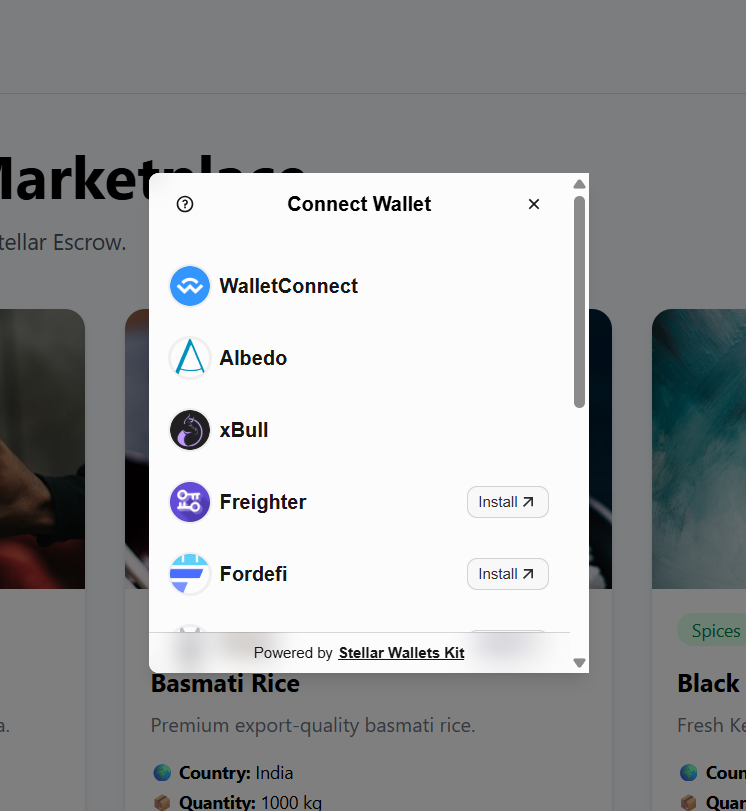

# 🌍 GlobalRoots

GlobalRoots is a decentralized cross-border trade marketplace built on the Stellar network.

The platform connects global buyers and sellers and uses Soroban smart contracts to manage the trade lifecycle transparently on-chain. GlobalRoots demonstrates multi-wallet integration, smart contract interaction, transaction status tracking, and real-time blockchain state synchronization.

---

## 🚀 Features

### 🧑‍💼 Seller

- Connect a Stellar wallet
- Add products to the marketplace
- View listed products
- Edit product information
- Delete products
- Track blockchain trade status
- Mark funded orders as shipped

### 🛒 Buyer

- Connect a Stellar wallet
- Browse products from global sellers
- View product details
- Create blockchain trades
- Track the complete trade lifecycle
- Fund a trade lifecycle
- Confirm product delivery
- Complete the trade process

---

## 👛 Multi-Wallet Integration

GlobalRoots integrates Stellar Wallets Kit to provide multiple wallet connection options.

The application supports wallet options including:

- Freighter
- WalletConnect
- QR-based mobile wallet connection
- Other Stellar wallets supported by Stellar Wallets Kit

WalletConnect allows users to connect compatible mobile wallets by scanning a QR code.

### 📸 Wallet Connection Screenshots

#### Screenshot 1 — Multi-Wallet Selection





<br><br>

#### Screenshot 2 — WalletConnect QR Connection


[WalletConnect QR](./screenshots/Screenshot 2026-07-16 202947.png)


---

## ⛓️ Blockchain Trade Flow

The GlobalRoots trade lifecycle is managed through a Soroban smart contract.

```text
Seller lists a product
        ↓
Buyer selects the product
        ↓
Buyer creates an on-chain trade
        ↓
     Created
        ↓
Buyer starts the funding stage
        ↓
     Funded
        ↓
Seller marks product as shipped
        ↓
     Shipped
        ↓
Buyer confirms delivery
        ↓
    Delivered
        ↓
Trade payment stage is released
        ↓
    Released
```

A trade can also be cancelled while it is in an eligible state.

> **Note:** The current Yellow Belt version demonstrates the on-chain escrow lifecycle and state transitions. The contract tracks funding and payment-release states but does not yet perform actual XLM token custody or transfers.

---

## 🔐 Soroban Smart Contract

The smart contract provides the following functions:

- `create_trade` — Creates and stores a new trade on-chain
- `get_trade` — Reads trade information from the blockchain
- `fund_trade` — Moves the trade to the funded state
- `ship_trade` — Marks the product as shipped
- `confirm_delivery` — Confirms that the buyer received the product
- `release_payment` — Completes the payment-release stage
- `cancel_trade` — Cancels an eligible trade

---

## 📊 Trade Status Lifecycle

```text
Created
   ↓
Funded
   ↓
Shipped
   ↓
Delivered
   ↓
Released
```

Alternative flow:

```text
Created
   ↓
Cancelled
```

---

# 🟡 Stellar Journey to Mastery — Yellow Belt

GlobalRoots was developed to demonstrate the requirements of the Stellar Journey to Mastery Yellow Belt.

## ✅ Yellow Belt Requirements

| Requirement | GlobalRoots Implementation |
|---|---|
| Stellar Wallets Kit | ✅ Integrated |
| Multi-wallet integration | ✅ Supported |
| WalletConnect | ✅ Integrated |
| QR mobile wallet connection | ✅ Working |
| 3+ error types handled | ✅ Implemented |
| Smart contract deployed | ✅ Stellar Testnet |
| Contract called from frontend | ✅ Implemented |
| Contract data reading | ✅ `get_trade` |
| Contract data writing | ✅ Trade lifecycle functions |
| Transaction status tracking | ✅ Pending / Success / Failed |
| State synchronization | ✅ Blockchain state synchronization |
| 2+ meaningful Git commits | ✅ Completed |

---

## ⚠️ Error Handling

The application handles multiple wallet and transaction error scenarios.

### 1. Wallet Not Connected

The application prevents blockchain transactions when no wallet is connected and asks the user to connect a wallet.

### 2. Transaction Rejected

If the user rejects a wallet transaction, the transaction is marked as failed and an error message is displayed.

### 3. Insufficient Balance

The application handles failed transactions caused by insufficient wallet balance and displays an appropriate error state.

### 4. General Transaction Failure

Unexpected smart contract and wallet transaction errors are caught and displayed to the user.

---

## 🔄 Transaction Status Tracking

Blockchain transactions display their current state in the application.

```text
⏳ Pending
      ↓
✅ Success
```

If the transaction fails:

```text
⏳ Pending
      ↓
❌ Failed
```

This provides clear feedback while a blockchain transaction is being processed.

---

## ⚡ Real-Time State Synchronization

Trade information is read directly from the deployed Soroban smart contract.

The Trade Details interface synchronizes the latest blockchain trade state so users can see lifecycle changes such as:

```text
Created → Funded → Shipped → Delivered → Released
```

This keeps the frontend synchronized with the contract state.

---

## 📜 Deployed Smart Contract

**Network:** Stellar Testnet

**Contract Address:**

```text
CBNEXEXZYSGDT3OOWJHWOEEZP6OP75UEANEPHSEXZE5PTYAP7HB5BAG6
```

---

## 🔗 Verified Smart Contract Transaction

A successful `create_trade` contract call was executed on Stellar Testnet.

**Transaction Hash:**

```text
0f538022d7192e20470297638076123f820ef5092a5070d87b210e41a4ac4b16
```

This transaction can be verified using a Stellar Testnet blockchain explorer.

---

## 🛠️ Tech Stack

### Frontend

- React
- TypeScript
- Vite
- Tailwind CSS
- React Router

### Blockchain

- Stellar
- Soroban
- Rust
- Stellar Testnet
- Stellar SDK

### Wallet Integration

- Stellar Wallets Kit
- WalletConnect
- Reown
- Freighter support

---

## 📂 Project Structure

```text
GlobalRoots/
│
├── contracts/
│   └── escrow/
│       ├── contracts/
│       ├── bindings/
│       └── Cargo.toml
│
├── frontend/
│   ├── src/
│   │   ├── components/
│   │   ├── context/
│   │   ├── hooks/
│   │   ├── pages/
│   │   ├── services/
│   │   └── wallet/
│   │
│   └── package.json
│
└── README.md
```

---

## ⚙️ Local Setup

### 1. Clone the Repository

```bash
git clone <YOUR_GITHUB_REPOSITORY_URL>
cd GlobalRoots
```

### 2. Install Frontend Dependencies

```bash
cd frontend
npm install
```

### 3. Configure WalletConnect

Create a `.env` file inside the `frontend` directory:

```env
VITE_REOWN_PROJECT_ID=YOUR_REOWN_PROJECT_ID
```

Do not commit your local `.env` file to the repository.

### 4. Start the Development Server

```bash
npm run dev
```

### 5. Create a Production Build

```bash
npm run build
```

---

## 🧪 Smart Contract Build

Navigate to the escrow contract workspace and build the Soroban contract:

```bash
stellar contract build
```

The deployed version of the contract is currently running on Stellar Testnet.

---

## 🎯 Yellow Belt Deliverable

GlobalRoots demonstrates:

- Multi-wallet connectivity using Stellar Wallets Kit
- WalletConnect QR-based mobile wallet connection
- A deployed Soroban smart contract on Stellar Testnet
- Smart contract calls directly from the React frontend
- On-chain trade data reading and writing
- Transaction pending, success, and failure states
- Error handling for common wallet and transaction failures
- Blockchain trade state synchronization

---

## 🚧 Future Improvements

The next versions of GlobalRoots can introduce:

- Real XLM or Stellar asset escrow custody
- Stablecoin payments such as USDC
- Logistics and shipment tracking
- Buyer and seller dispute resolution
- Decentralized trade documentation
- Product verification
- Seller reputation system
- Cross-border settlement
- Mainnet deployment

---

## 📄 License

This project was developed as part of the Stellar Journey to Mastery program.
